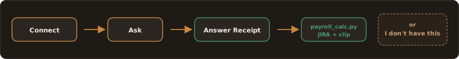
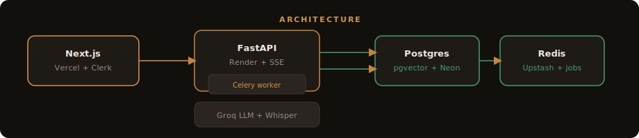
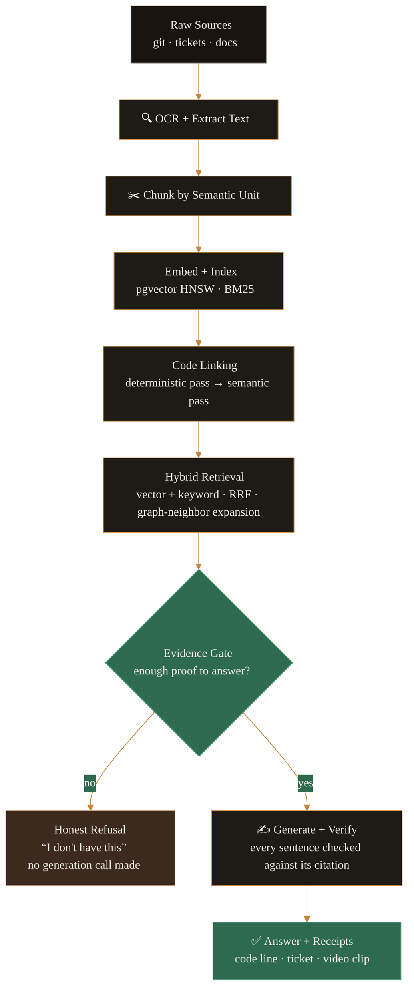

<div align="center">


<br />

### Code tells you *what*. Backstory remembers *why*.

<a href="https://backstory-ai.vercel.app">
  
</a>
&nbsp;


<br /><br />

[**Try it**](https://backstory-ai.vercel.app) · [The problem](#the-problem-nobody-documents) · [How it works](#how-it-works) · [Three horizons](#the-three-horizons) · [Tech stack](#tech-stack) · [Architecture](#architecture) · [After the MVP](#after-the-mvp) · [Run locally](#run-it-locally) · [License](#license)

</div>

<br />

> **Why does the payroll job fail on months with 31 days?**
>
> Maya types that into Backstory before any interview has ever been recorded. Eight seconds later she has an answer: the root cause traces to a 2011 banking API workaround, cited to ticket `#4821` and commit `a7f3c2`. She clicks the ticket. She clicks the code. Both open at the exact line.
>
> That moment — a real answer to a question that used to mean tracking down someone who half-remembers, or someone who's already retired — is the entire bet this product is built on.

<br />

---

## The problem nobody documents

Every legacy system is haunted by decisions nobody remembers making. Why is the retry count `7`? Why must that date check never be removed? Why does the payroll job choke every December?

Somebody knew. They retired. They quit. They moved teams. The answer didn't leave with malice — it just left, the way undocumented knowledge always does, quietly and all at once, usually a few weeks before an audit asks for it in writing.

The code still runs. It just stopped explaining itself a long time ago.

**Backstory is the memory layer that captures the *why* before it walks out the door** — from years of commits and tickets nobody re-reads, from AI-guided interviews with the people about to leave, and from every incident fix as it happens — and answers questions about it in plain English, with proof you can click on.

No source, no claim. Ever. If the memory genuinely doesn't know, it says so.

<br />

## Why this, why now

| | |
|---|---|
| **The retirement cliff** | The engineers who built and patched COBOL, early Java, and bespoke ERP systems through the '90s and 2000s are retiring on a clock that doesn't pause for your modernization roadmap. |
| **The modernization wave** | Banks, insurers, and governments are under real regulatory pressure to modernize core systems they no longer fully understand — and "we don't know why it works" is not an answer an auditor accepts. |
| **AI finally makes it tractable** | Frontier LLMs, cheap accurate transcription, and vector retrieval mean linking decades of unstructured tribal knowledge to specific lines of code is, for the first time, actually buildable. |

<br />

---

## 🕰 The three horizons

Most tools cover one slice of a system's history. Backstory is built around the idea that knowledge has to be captured at **three different points in time**, and that no single one of them is enough on its own.

<table width="100%">
<tr>
<td width="33%" align="center" valign="top">

### Horizon 1 — The Past
**Everything that already happened.**

Git history back to day one. Every ticket and its resolution. Runbooks, PDFs, the Confluence export nobody opens anymore. This data already exists in your systems right now — Backstory ingests it and creates value before a single interview is recorded.

</td>
<td width="33%" align="center" valign="top">

### Horizon 2 — The Leaving
**The expert, before they're gone.**

Not a generic exit interview. Backstory reads the codebase first — the files patched 47 times, the 3am emergency commits, the single-owner modules — and generates questions only that person could answer. Ahmed's reaction is always the same: *"How does it know about that?"*

</td>
<td width="33%" align="center" valign="top">

### Horizon 3 — The Present
**The memory that never stops growing.**

Every incident that gets resolved becomes part of the record — the fix, the ticket, who did it — captured automatically, linked to the code it touched. Zero extra effort from anyone. After a year of this, the knowledge base is something no competitor can replicate by showing up later.

</td>
</tr>
</table>

<div align="center">
<sub>Past + Leaving + Present — together, not separately. That combination is the moat.</sub>
</div>

<br />

---

## ⚡ How it works

<div align="center">

</div>

<br />

**1. Connect.** GitHub or GitLab, Jira/Linear/GitHub Issues, and any PDFs, Word docs, or runbooks worth saving. Each source shows live status — `Queued → Processing → Indexed`, or a clear `Error` you can actually act on.

**2. Ask.** One chat box. Plain English, or Urdu. No query syntax, no "select your data source first."

```
"Why does the payroll job fail on months with 31 days?"
```

**3. Get proof, not prose.** The answer streams in token by token. Every claim in it is backed by a clickable **Answer Receipt** — the exact code line, the ticket number, the video clip that opens at the precise second an engineer explains it.

```
payroll_calc.py:142  ·  JIRA-4821  ·  Ahmed's interview @ 14:32
```

Click any of them. They open at the exact location. Not "somewhere in this file" — line 142.

**4. Or get an honest no.** If the memory genuinely doesn't contain the answer, Backstory says **"I don't have this."** Not a guess dressed up as confidence. The refusal card is as polished as a successful answer, and it always offers the next move: start an interview, or upload the missing document. Every gap becomes a prompt to fix the gap.

> **This rule has no setting to turn it off.** One confident hallucination is enough to destroy trust in everything else the system says. So refusal isn't a fallback — it's load-bearing.

<br />

---

## 🎙 The Archaeology Brief

This is the feature that makes people stop and ask *"wait, how did it know that?"*

Before anyone sits down to interview a departing expert, Backstory studies the system on its own: which files get patched constantly, which ones only one person has ever touched, where the 3am emergency commits cluster, where ticket density spikes without explanation. It turns those risk signals into a short list of sharp, specific questions — the kind a generic "tell us everything you know" exit interview never gets to.

<table width="100%"><tr><td>

**Ahmed** has 22 years on the system and 90 days until he retires. He's done the generic knowledge-transfer sessions before — they're exhausting and go nowhere. Backstory hands him something different: *"You touched `payroll_calc.py` 47 times, mostly in December. What broke?"*

He didn't expect the question to be that specific. That surprise — **"how does it know about that?"** — is the product working exactly as intended.

His answer is recorded on video, every sentence timestamped. Two years from now, when someone else hits the same wall at 2am, the clip is waiting for them, already linked to the line of code it explains.

</td></tr></table>

<br />

---

## 🎨 Tech stack

<div align="center">

</div>

<br />

<table width="100%">
<tr><th align="left" width="18%">Layer</th><th align="left">Choice</th><th align="left">Why</th></tr>
<tr>
<td valign="top">

🟧 **Frontend**

</td>
<td valign="top">

Next.js 15 · TypeScript<br/>Tailwind + shadcn/ui<br/>TanStack Query · SSE

</td>
<td valign="top">Streamed answers need a UI that can render tokens as they arrive without janking the citation chips around them.</td>
</tr>
<tr>
<td valign="top">

🟫 **API / Backend**

</td>
<td valign="top">

Python · FastAPI<br/>Celery + Redis workers<br/>SSE endpoints

</td>
<td valign="top">Ingestion is async and bursty (a full repo import vs. a single question), so the queue and the request path are deliberately separate.</td>
</tr>
<tr>
<td valign="top">

🟩 **Data**

</td>
<td valign="top">

Postgres + pgvector<br/>Cloudflare R2 (blobs)<br/>Redis (queue / cache)

</td>
<td valign="top">One database for relational, vector, and full-text — the knowledge graph (<code>link</code> table) and the embeddings live next to each other, not in separate systems that drift apart.</td>
</tr>
<tr>
<td valign="top">

⬛ **AI / ML**

</td>
<td valign="top">

Frontier LLM API<br/>Whisper transcription<br/>Embedding API · Langfuse evals

</td>
<td valign="top">The model sits behind a provider abstraction on purpose — it's a commodity input, not the moat. Langfuse is what makes the refusal rate a number you can gate CI on, not a vibe.</td>
</tr>
<tr>
<td valign="top">

🟨 **Auth / Infra**

</td>
<td valign="top">

Clerk (auth + orgs + RBAC)<br/>Vercel + Fly.io + Neon<br/>GitHub Actions · Sentry

</td>
<td valign="top">Multi-tenant from day one — every org/engagement boundary is enforced at the auth layer, not bolted on later when a customer asks about data isolation.</td>
</tr>
</table>

<br />

---

## 🧭 Architecture

The part that actually matters isn't any single piece of the stack above — it's the **double grounding gate** that sits between retrieval and generation. The model is never allowed to answer from evidence that isn't there.



There's a gate **before** generation — do we even have enough evidence to attempt this — and a gate **after** — does every sentence the model wrote actually trace back to a real citation. Both have to pass, every time, with no override.

<details>
<summary><strong>Data model — the entities that hold the knowledge graph together</strong></summary>
<br />

| Entity | What it stores | Key relationship |
|---|---|---|
| `org` / `engagement` | Tenancy boundary — every row scoped here | Root of all data isolation |
| `source` | Connected repo, ticket project, or doc set + sync status | Belongs to engagement |
| `code_entity` | A file or function at a specific revision and line range | Linked to artifacts via `link` |
| `artifact` | A ticket, a doc chunk, or an interview statement | Linked to `code_entity` |
| `chunk` | A retrievable unit — embedding vector + full-text index | Belongs to an artifact |
| `link` | The knowledge-graph edge: artifact ↔ code, with a confidence score | Powers cross-horizon answers |
| `transcript_segment` | A time-coded interview segment — the anchor for a video clip | Stored as artifact, linked to code |
| `answer` / `citation` | The persisted answer and its resolved Receipts | Audit trail, shareable |

</details>

<details>
<summary><strong>Design principles, if you're picking apart the UI</strong></summary>
<br />

- **Evidence-first** — citations sit beside the prose, not below it. The UI is built to make verifying faster than doubting.
- **Trust-signalling** — refusal is a confident, first-class screen, not an error state. Confidence, source count, and freshness stay visible at all times.
- **Flat and calm** — minimal chrome, real whitespace. The legacy-systems buyer wants a serious instrument, not a toy.
- **Code-aware everywhere** — code lines, tickets, and clips render as clickable primitives wherever they show up, not just on one dedicated page.
- **Respectful capture** — interview surfaces stay warm and low-pressure. Consent and recording state are unmissable. The departing expert should never feel surveilled.
- **Progress is the product** — ingestion status and coverage are always legible, because buyers pay for that number.

</details>

<br />

---

## 🧪 Run it locally

**You'll need:** Node 20+, pnpm, Python 3.12, [`uv`](https://docs.astral.sh/uv/), Docker, and a [Clerk](https://clerk.com) account with Organizations enabled.

```bash
git clone git@github.com:MQ-06/backstory-ai.git && cd backstory-ai
cp .env.example apps/api/.env && cp .env.example apps/web/.env.local
make install && make up && make db-migrate && make dev
```

Second terminal — needed for file uploads and transcription:

```bash
make dev-worker
```

**To load the demo:** sign in → **Settings** → copy your org id, then:

```bash
export DEMO_CLERK_ORG_ID=org_xxxxxxxx && make demo-seed
```

| | |
|---|---|
| Web app | `localhost:3000` |
| API | `localhost:8000` |

Open the **Streetlight Payroll Demo**, ask it something, click a citation. That's the whole pitch in about ten seconds.

<br />

---

## 📍 Inside the app

<table width="100%">
<tr>
<td align="center" width="25%"><strong>Ask</strong><br/><sub>cited answers, streamed</sub></td>
<td align="center" width="25%"><strong>Sources</strong><br/><sub>git · tickets · docs</sub></td>
<td align="center" width="25%"><strong>Interviews</strong><br/><sub>brief · studio · clips</sub></td>
<td align="center" width="25%"><strong>Library</strong><br/><sub>every artifact, browsable</sub></td>
</tr>
</table>

<br />

---

## 🗺 After the MVP

The MVP covers Features 1–10: ingestion, code linking, plain-language Q&A, honest refusal, cross-horizon search, Answer Receipts, video interviews, and the Archaeology Brief — the demo no competitor can replicate. What ships after that is where the product compounds.

| Wave | What ships | The idea |
|---|---|---|
| **Right after launch** | Guardian Mode, post-fix micro-interviews, verbal commit messages | The flywheel — knowledge capture stops needing anyone to remember to do it |
| **First pilot** | Completeness scoring, module handover briefs | Turns a pilot into something with a measurable deliverable |
| **First enterprise deal** | Knowledge Insurance Report, risk heatmap, self-hosted/air-gapped | What a CTO actually signs a check for |
| **V3** | Code Funeral Notices, the rest | Preserve the knowledge context even after the code itself is deleted |

<br />

---

## 🎯 What "working" looks like

The North Star is simple to state and hard to fake: **verified cited answers that save real time** — answers that shipped with valid Answer Receipts and that someone actually acted on. Not queries. Not sessions. Answers people trusted enough to use.

A few signals underneath that:

- **Time to first cited answer** — should happen in the first session, not the first week.
- **Escalations to the departing expert** — should trend down as the team starts asking Backstory first.
- **Unprompted usage in week 3** — the honest tell that this became a habit instead of a novelty.

<br />

---

## 🛡 The non-negotiables

Two rules in this product don't have a config flag:

1. **Every claim has a source, or the claim doesn't ship.** If the evidence gate doesn't clear, generation doesn't even run.
2. **"I don't have this" is always on the table, and it's never styled like a failure.** A gap in the memory is a prompt to fill the gap — not something to paper over with a confident guess.

One hallucination is enough to undo every correct answer that came before it. So refusal isn't the fallback path here. It's the foundation everything else stands on.

<br />

---

## 📜 License

This project is **proprietary and confidential**. All rights reserved.

The source code, product design, and documentation in this repository are not licensed for reuse, redistribution, or modification outside of authorized contributors. If you're evaluating Backstory for a pilot, an investment, or a partnership and need access terms in writing, reach out directly rather than assuming an open-source license applies.

> Swap this section for MIT/Apache-2.0/etc. if and when the project's licensing posture changes — this README assumes closed-source by default since none was specified.

<br />

---

<div align="center">

**Not another chatbot bolted onto your repo.**
A memory layer for the systems nobody fully understands anymore — including the people who built them.

<br />

<a href="https://backstory-ai.vercel.app">
  
</a>

<br /><br />

<sub>Code tells you what. Backstory remembers why.</sub>

</div>