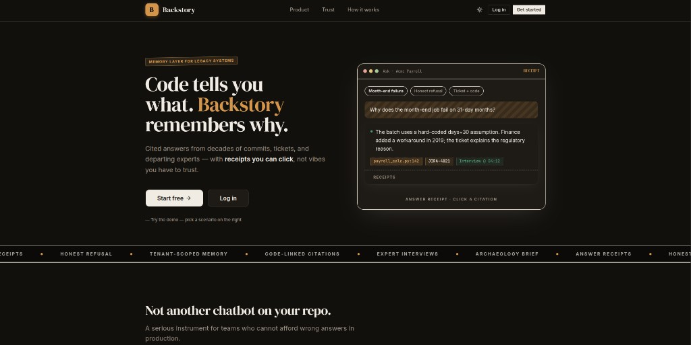

 

  

 

<table width="100%"><tr><td bgcolor="#1a1410" style="padding:28px 32px;border-radius:14px;">

THE IDEA

Legacy systems don’t fail because the code is missing. 
They fail because the <strong style="color:#d4954a;">why</strong> was never written down.

Git · tickets · docs · expert interviews — one memory layer. 
Ask in plain English. Every answer ships with <strong style="color:#4a9b72;">receipts you can click</strong>. 
No evidence? <strong style="color:#c9a07a;">“I don’t have this.”</strong> Always.

</td></tr></table>

 

<em>Not another chatbot on your repo.</em>

 

---

HOW IT WORKS

 

<table width="100%"><tr><td bgcolor="#1e1a15" style="padding:22px 28px;border-radius:12px;border:1px solid #3d3630;">

<strong style="color:#d4954a;">Archaeology Brief</strong> — before an expert leaves, Backstory reads the system’s risk signals and generates questions only they can answer. Record the interview. The next answer gets stronger.

payroll_calc.py:142 · JIRA-4821 · Interview @ 04:12

</td></tr></table>

 

---

UNDER THE HOOD

  

 

---

<table width="100%"><tr><td bgcolor="#12100d" style="padding:28px 32px;border-radius:14px;border-top:3px solid #d4954a;">

RUN IT LOCALLY

Node 20+ · pnpm · Python 3.12 · <a href="https://docs.astral.sh/uv/" style="color:#d4954a;">uv</a> · Docker · <a href="https://clerk.com" style="color:#d4954a;">Clerk</a> with Organizations

<pre style="background:#0c0a08;color:#f0ebe3;padding:16px 20px;border-radius:10px;border:1px solid #3d3630;overflow-x:auto;font-size:13px;line-height:1.5;"><code>git clone git@github.com:MQ-06/backstory-ai.git && cd backstory-ai
cp .env.example apps/api/.env && cp .env.example apps/web/.env.local
make install && make up && make db-migrate && make dev</code></pre>

Second terminal · uploads &amp; transcription:

<pre style="background:#0c0a08;color:#d4954a;padding:12px 20px;border-radius:10px;border:1px solid #3d3630;font-size:13px;margin:0;"><code>make dev-worker</code></pre>

Demo · sign in → <strong style="color:#f0ebe3;">Settings</strong> → copy org id:

<pre style="background:#0c0a08;color:#f0ebe3;padding:12px 20px;border-radius:10px;border:1px solid #3d3630;font-size:13px;margin:0;"><code>export DEMO_CLERK_ORG_ID=org_xxxxxxxx && make demo-seed</code></pre>

App → <code style="color:#4a9b72;background:#0c0a08;padding:2px 6px;border-radius:4px;">localhost:3000</code> &nbsp;·&nbsp; API → <code style="color:#4a9b72;background:#0c0a08;padding:2px 6px;border-radius:4px;">localhost:8000</code> 
Open <strong>Streetlight Payroll Demo</strong> · ask · click a citation.

</td></tr></table>

 

---

IN THE APP

<table>
<tr>
<td align="center" width="22%" style="padding:16px;"><strong style="color:#f0ebe3;">Ask</strong> cited answers</td>
<td align="center" width="22%" style="padding:16px;"><strong style="color:#f0ebe3;">Sources</strong> git · issues · docs</td>
<td align="center" width="22%" style="padding:16px;"><strong style="color:#d4954a;">Capture</strong> brief · interviews</td>
<td align="center" width="22%" style="padding:16px;"><strong style="color:#f0ebe3;">Library</strong> every artifact</td>
</tr>
</table>

 

  

Memory layer for legacy systems

