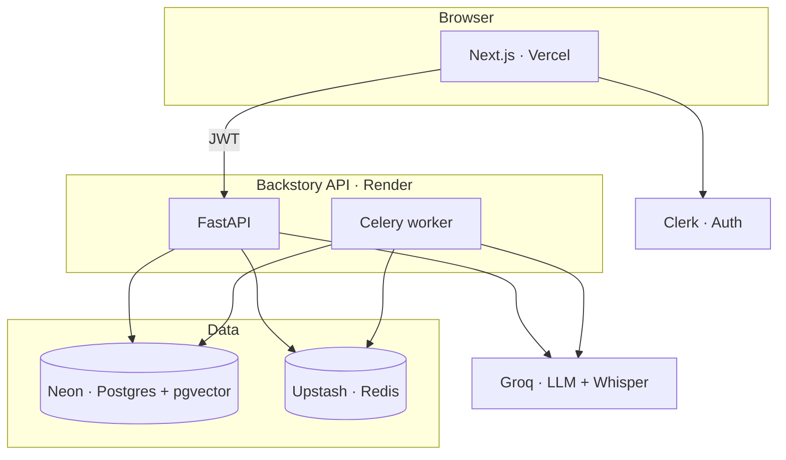

<div align="center">

# Backstory

### Code tells you what — <span style="color:#d4954a">Backstory remembers why.</span>

**The memory layer for legacy systems.**  
Cited answers from code, tickets, documents, and expert interviews — with receipts you can click, not vibes you have to trust.

<br />

[](https://github.com/MQ-06/backstory-ai/actions/workflows/ci.yml)
[](https://github.com/MQ-06/backstory-ai/releases)
[](FEATURES.md)

<br />

[**Live app →**](https://backstory-ai.vercel.app) · [**API health →**](https://backstory-ai.onrender.com/health) · [**Features spec →**](FEATURES.md)

<br />


*Ask a question. Get an answer with proof — `payroll_calc.py:142` · `JIRA-4821` · `Interview @ 04:12`*

</div>

<br />

---

## Not another chatbot on your repo

Backstory is a **serious instrument** for teams who cannot afford wrong answers in production. It captures the *why* behind legacy systems — from decades of commits and tickets, from departing experts on camera, from every fix as it happens — and delivers it **at the moment someone asks**.

<table>
<tr>
<td width="33%" align="center"><strong style="color:#d4954a">Capture</strong><br/><sub>Pull a why into the system</sub></td>
<td width="33%" align="center"><strong style="color:#4a9b72">Deliver</strong><br/><sub>Surface it when needed</sub></td>
<td width="33%" align="center"><strong style="color:#9a8f82">Protect</strong><br/><sub>Guard risky changes · coming V1.1</sub></td>
</tr>
</table>

<br />

> **Trust contract:** No source, no claim. Insufficient evidence → **“I don’t have this.”** Non-configurable. Engagement-scoped. Always.

<br />

---

## What ships in v0.1.0

<table>
<tr><td><strong style="color:#d4954a">01</strong></td><td><strong>Git ingestion</strong></td><td>Repos, commits, blame — indexed per engagement</td></tr>
<tr><td><strong style="color:#d4954a">02</strong></td><td><strong>Ticket import</strong></td><td>GitHub Issues (Jira/Linear on roadmap)</td></tr>
<tr><td><strong style="color:#d4954a">03</strong></td><td><strong>Document upload</strong></td><td>PDFs, Word, runbooks</td></tr>
<tr><td><strong style="color:#d4954a">04</strong></td><td><strong>Code linking</strong></td><td>Tickets & docs pinned to files and line ranges</td></tr>
<tr><td><strong style="color:#d4954a">05</strong></td><td><strong>Video interviews</strong></td><td>Timestamped transcripts · clip citations</td></tr>
<tr><td><strong style="color:#4a9b72">06</strong></td><td><strong>Plain-language Ask</strong></td><td>One box · all horizons at once</td></tr>
<tr><td><strong style="color:#4a9b72">07</strong></td><td><strong>Honest refusal</strong></td><td>No hallucination when memory is thin</td></tr>
<tr><td><strong style="color:#4a9b72">08</strong></td><td><strong>Cross-horizon search</strong></td><td>Code + tickets + docs + interviews together</td></tr>
<tr><td><strong style="color:#4a9b72">09</strong></td><td><strong>Answer Receipts</strong></td><td>Every claim → clickable proof</td></tr>
<tr><td><strong style="color:#d4954a">10</strong></td><td><strong>Archaeology Brief</strong></td><td>Interview prep from risk signals in the system</td></tr>
</table>

<details>
<summary><strong>Upcoming · Features 11–17</strong></summary>

<br />

| Wave | Features |
|------|----------|
| **V1.1** | 11 Guardian Mode · 12 Post-fix micro-interview · 13 Verbal commits |
| **Pilot** | 14 Completeness score · 15 Knowledge handshake |
| **Enterprise** | 17 Insurance report · heatmap · self-hosted |
| **V3** | 16 Code funeral notices |

Full specs → [FEATURES.md](FEATURES.md)

</details>

<br />

---

## Try it

| | |
|---|---|
| **Web** | [backstory-ai.vercel.app](https://backstory-ai.vercel.app) |
| **API** | [backstory-ai.onrender.com](https://backstory-ai.onrender.com) |
| **Health** | `curl https://backstory-ai.onrender.com/health` |

Sign in → **Settings** → copy your org id → seed the **Streetlight Payroll Demo** (see Quick start below).

<br />

---

## Quick start

**Prerequisites:** Node 20+ · pnpm 9+ · Python 3.12+ · [uv](https://docs.astral.sh/uv/) · Docker · [Clerk](https://clerk.com) with Organizations

```bash
git clone git@github.com:MQ-06/backstory-ai.git
cd backstory-ai

cp .env.example apps/api/.env
cp .env.example apps/web/.env.local
# Clerk keys in both files · allow http://localhost:3000 in Clerk

make install && make up && make db-migrate && make dev
# separate terminal: make dev-worker
```

| Service | URL |
|---------|-----|
| Web | http://localhost:3000 |
| API | http://localhost:8000/health |

**Seed the demo** — sign in, open **Settings** (`/admin`), copy `DEMO_CLERK_ORG_ID`, then:

```bash
export DEMO_CLERK_ORG_ID=org_xxxxxxxx
make demo-seed
```

**15-min demo path:** Sources → Ask (*Why does payroll fail on 31-day months?*) → Archaeology Brief → Interview Studio → Library.

<br />

---

## Architecture



<br />

---

## Stack

| Layer | Tech |
|-------|------|
| **Web** | Next.js 15 · TypeScript · Clerk · TanStack Query · shadcn/ui |
| **API** | FastAPI · SQLAlchemy async · Alembic |
| **Data** | Postgres + pgvector · Redis · R2 (later) |
| **Jobs** | Celery — ingest · transcribe |
| **LLM** | Groq (Ask, Brief, Whisper) · local embeddings |

<br />

---

## Brand palette

Archival warm dark — not hacker green.

| Token | Light | Dark |
|-------|-------|------|
| **Ink** | `#1a1410` | `#f0ebe3` |
| **Parchment** | `#f7f3ec` | `#12100d` |
| **Amber** | `#c8853a` | `#d4954a` |
| **Proof** | `#2d6a4f` | `#4a9b72` |

Defined in `apps/web/src/app/globals.css`.

<br />

---

## Development

```bash
make test                    # API pytest
pnpm --filter web typecheck
pnpm --filter web build
make test-e2e                # Playwright (after make e2e-install)
```

CI on every push to `main` / `develop` → [.github/workflows/ci.yml](.github/workflows/ci.yml)

<br />

---

## Repository

| Path | Purpose |
|------|---------|
| [FEATURES.md](FEATURES.md) | Feature specs · source of truth |
| `apps/web/` | Next.js frontend |
| `apps/api/` | FastAPI backend |
| `.github/workflows/` | CI · staging deploy |

<br />

---

<div align="center">

<sub>

**Backstory** · v0.1.0 MVP · Features 1–10  
Proprietary — all rights reserved

</sub>

</div>
